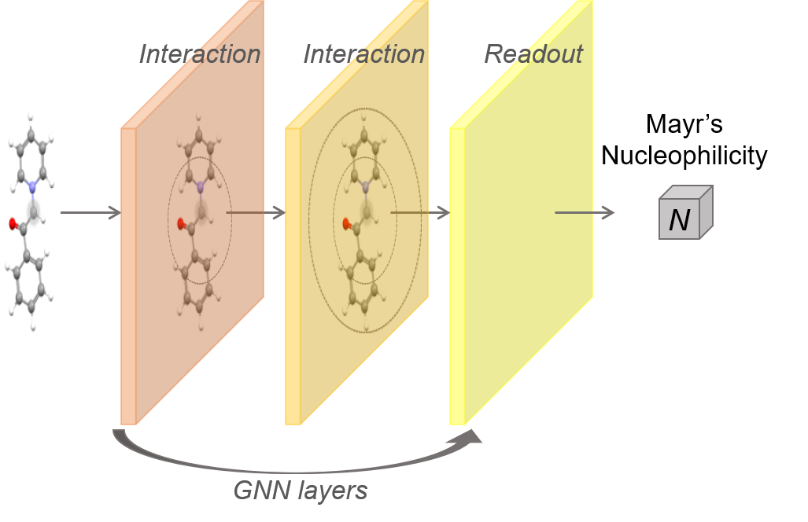

# Nucleophilicity Prediction using Graph Neural Networks



This repository provides two SchNet-based<sup>[1]</sup> GNN architectures named Z-SchNet and Z-SchNet-CDFT which are
used to predict molecules' nucleophilicity parameters $N$ in Mayr's equation<sup>[2]</sup>

$$\mathrm{log}_{10} k(20^\circ \mathrm{C}) = s_N(N+E) \ .$$

## Dataset

Nguyen's benchmark dataset<sup>[3]</sup> providing SDF files of molecules were processed into a list composed
of `torch_geometric.data.Data` objects.
Meanwhile, we also obtained 10 electronic descriptors for each molecule using DFT calculations. The processed dataset is
stored in `resources/raw_dataset.pt`.

```
>>> import torch
>>> dataset = torch.load('./resources/raw_dataset.pt')
>>> data = dataset[0]
>>> type(data)
<class 'torch_geometric.data.data.Data'>
>>> data
Data(x=[21, 1], y=16.280000686645508, pos=[21, 3], edge_index_3=[2, 148], edge_index_5=[2, 298], edge_index_10=[2, 420], edge_index_20=[2, 420], bond_index=[2, 42], solvent=1, nuc_index=3, cdft=[1, 10], Z=[21, 1], name='molecule_511', edge_index=[2, 298], nuc_type='C-Anion', train_test='Train')
```

| Attribute            | Description                                                                                                                                                                     |
|----------------------|---------------------------------------------------------------------------------------------------------------------------------------------------------------------------------|
| `data.x`             | A tensor, the molecule's atomic numbers.                                                                                                                                        |
| `data.y`             | A tensor, true value of the molecule's nucleophilicity parameter *N*.                                                                                                           |
| `data.pos`           | A tensor, 3D coordinates of the atoms.                                                                                                                                          |
| `data.edge_index_3`  | A tensor, the edge_index of the molecular graph with 3 Å distance cutoff.                                                                                                       |
| `data.edge_index_5`  | A tensor, the edge_index of the molecular graph with 5 Å distance cutoff.                                                                                                       |
| `data.edge_index_10` | A tensor, the edge_index of the molecular graph with 10 Å distance cutoff.                                                                                                      |
| `data.edge_index_20` | A tensor, the edge_index of the molecular graph with 20 Å distance cutoff.                                                                                                      |
| `data.bond_index`    | A tensor, the bond_index of the molecular graph (based on the molecule' connectivity).                                                                                          |
| `data.solvent`       | A tensor, the solvent id. <br/>`{'water': 0, 'dimethylsulfoxide': 1, 'dichloromethane': 2, 'acetonitrile': 3}`                                                                  |
| `data.nuc_index`     | A tensor, the nucleophilic atom's index in the molecule; starts from 1.                                                                                                         |
| `data.cdft`          | A tensor, the 9 cdft indices and solvation energy of the molecule.                                                                                                              |
| `data.Z`             | A tensor, the molecule's atomic numbers that equals to `data.x` in this dataset.                                                                                                |
| `data.name`          | A string, the molecule's name in Nguyen's dataset.                                                                                                                              |
| `data.edge_index`    | A tensor, the edge_index of the molecular graph that will be used in the training. <br/>It should be one of `edge_index_3`,`edge_index_5`,`edge_index_10`, and `edge_index_20`. |
| `data.nuc_type`      | A string, the nucleophile type of the molecule.                                                                                                                                 |
| `data.train_test`    | A string, indicating whether the `data` belongs to the training or test set in the training:test split.                                                                         |


## Training the model

##### Training command example

`python -u main.py --cuda --cutoff 5`

```
[wnie@DEV GNN-nucleophilicity]$ python main.py -h
usage: Get 10-fold cross-validation result. [-h] [--model MODEL] [--cutoff CUTOFF] [--cuda] [--runs RUNS]

optional arguments:
  -h, --help       show this help message and exit
  --model MODEL    specify the model type from SchNetAvg/SchNetNuc/ZSchNet/ZSchNet_CDFT (default: ZSchNet_CDFT)
  --cutoff CUTOFF  distance cutoff to define atom neighbors (default: 5); choose one from [3, 5, 10, 20]
  --cuda           use a GPU to train the model
  --runs RUNS      runs number of the 10-fold CV (default: 10)
```

Other detailed training parameters, e.g., batch size and epochs, can be modified in `config.py`.

## References

* [1] Schütt, K. T.; Kindermans, P.-J.; Sauceda, H. E.; Chmiela, S.; Tkatchenko, A.; Müller, K.-R.
  SchNet: A continuous-filter convolutional neural network for modeling quantum interactions.
  *Advances in Neural Information Processing Systems* 30, pp. 992-1002 
  (**2017**) [link](http://papers.nips.cc/paper/6700-schnet-a-continuous-filter-convolutional-neural-network-for-modeling-quantum-interactions)

* [2] Mayr, H.; Schneider, R.; Schade, C.; Bartl, J.; Bederke, R.
  Addition reactions of diarylcarbenium ions to 2-methyl-1-pentene: kinetic method and reaction mechanism.
  *J. Am. Chem. Soc.* **1990**, 112, 4446–4454. [link](https://pubs.acs.org/doi/10.1021/ja00167a049)

* [3] Boobier, S.; Liu, Y.; Sharma, K.; Hose, D. R. J.; Blacker, A. J.; Kapur, N.; Nguyen, B. N.
  Predicting Solvent-Dependent Nucleophilicity Parameter with a Causal Structure Property Relationship.
  *J. Chem. Inf. Model.* **2021**, 61, 4890–4899. [link](https://pubs.acs.org/doi/10.1021/acs.jcim.1c00610)
